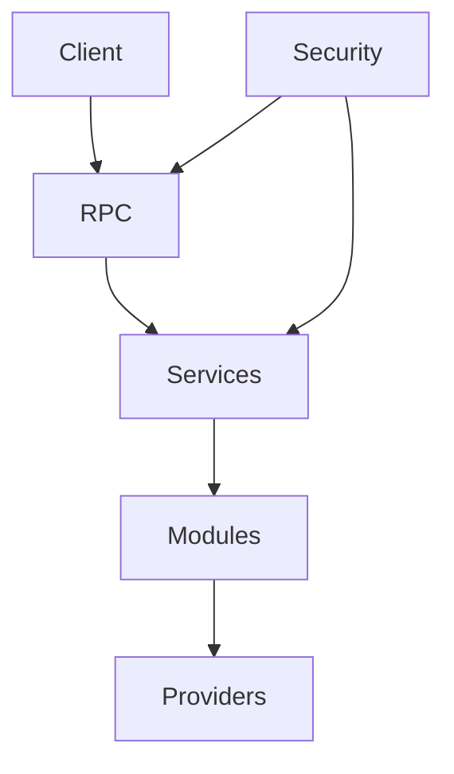

# System Architecture and Security

This document describes the overall system architecture, layered components,
and the security model including role assignments and how RPC namespaces enforce them.

## Layered Architecture

* **Client** – User owned frontend or external application.
* **RPC** – Typed boundary that exposes the public namespace. Only bearer tokens are accepted.
* **Services** – Business logic invoked by RPC handlers.
* **Modules** – Internal runtime modules loaded by the server. Modules communicate only through their contracts.
* **Providers** – External systems such as databases and identity services.
* **Security** – Cross cutting layer enforcing authentication, authorization, and privacy rules. Data marked internal never leaves the server.

## Security Model

### Role Bit Assignments

This project uses a signed 64‑bit integer to represent security roles and user feature
flags. Bit 63 is unused to avoid the sign bit. High bits define system roles and the
low bits are used for user level flags.

| Bit | Hex Value             | Role Name                 | Notes |
|----:|----------------------:|---------------------------|------|
| 62  | `0x4000000000000000`  | `ROLE_SERVICE_ADMIN`      | The configuration of the service, such as API keys |
| 61  | `0x2000000000000000`  | `ROLE_SYSTEM_ADMIN`       | Access to system configuration features |
| 60  | `0x1000000000000000`  | `ROLE_ACCOUNT_ADMIN`      | Manage security role definitions and user assignments |
| 59  | `0x0800000000000000`  | `ROLE_MODERATOR`          | Access to moderation tools |
| 58  | `0x0400000000000000`  | `ROLE_SUPPORT`            | Access to support utilities |
| 57  | `0x0200000000000000`  | *(reserved)*              | |
| 56  | `0x0100000000000000`  | *(reserved)*              | |
| ... | ...                   |                           | |
| 6   | `0x0000000000000040`  | `ROLE_DISCORD_BOT`        | Allows the user to interact with the system via Discord |
| 5   | `0x0000000000000020`  | `ROLE_LUMAAI_VIDEO`       | Allows the user to generate videos with LumaLabs AI |
| 4   | `0x0000000000000010`  | `ROLE_OPENAI_TEXT`        | Allows the user to generate text with OpenAI |
| 3   | `0x0000000000000008`  | `ROLE_OPENAI_TTS`         | Allows the user to generate TTS with OpenAI |
| 2   | `0x0000000000000004`  | `ROLE_OPENAI_IMAGE`       | Allows the user to generate images with OpenAI |
| 1   | `0x0000000000000002`  | `ROLE_STORAGE`            | Allows access to the storage domain |
| 0   | `0x0000000000000001`  | `ROLE_REGISTERED`         | Grants access to profile and provider management |

`ROLE_GLOBAL_ADMIN = ROLE_SERVICE_ADMIN | ROLE_SYSTEM_ADMIN | ROLE_MODERATOR | ROLE_SUPPORT`
`ROLE_SERVICE_AGENT = ROLE_MODERATOR | ROLE_SUPPORT`

The two lowest bits represent the base user roles: `ROLE_REGISTERED` for profile and
provider access and `ROLE_STORAGE` for the storage domain.

### Authentication Domains

Understanding the various domains and where values are used and stored is vital to the
stability of the application.

#### Provider Domain

The authentication provider is a client-side domain. The client libraries (e.g. MSAL)
obtain tokens that validate the user's identity against public JWKS. Four pieces of
data are passed to the app:

1. User's unique identifier
2. User's email address or primary username
3. User's profile image
4. User's display name

#### Application Domain

The user's local session on a device. This session includes a bearer token which
identifies the unique session and device. When a request is made the bearer token is
decoded and security is looked up in the back end. If authorized, the RPC transaction
continues. The client retains only this bearer token containing the user's randomly
assigned GUID; no personal details are included.

#### Server Domain

The backend server handles all requests. The server domain includes the database and
retains:

1. User's unique account identifier
2. User's email address*
3. User's unique session and device identifier
4. User's profile image (if available)

*Email addresses are required for purchase receipts and cannot be removed. Users may
hide their address from public profiles, and the service sends no other email communications.

#### Account Provisioning

Accounts can only be created through trusted identity providers (**Microsoft**, **Google**,
**Discord**, and **Apple**). No local credentials are ever issued or stored. When a user
signs in for the first time, the provider identifier becomes the primary key used by the
server to link all subsequent logins.

#### Authentication Workflow

1. Client obtains an ID token from an identity provider.
2. Token is sent to the server and validated against the provider's JWKS.
3. For new accounts a GUID is generated and the provider becomes the user's primary provider.
4. Existing accounts are looked up by GUID and their session/device records are refreshed.
5. A server-signed bearer token is returned to the client and used for all RPC calls.

#### Personal Data and Privacy

The server stores only minimal personal information:

* GUID (internal identifier)
* Email address *(required; used only for purchase receipts)*
* Profile image *(optional)*

#### Provider Association

Each account is linked to a single primary provider for lookup and auditing. Identity
provider data is not used in internal cryptographic operations; it is only used to
validate the provider's identity token during authentication. All encryption and signing
routines rely solely on internal keys.

### RPC Namespace Integration

Every RPC call must include a server-issued bearer token. Anonymous requests are limited
to the `public.*` and `auth.*` namespaces. All other namespaces require a security lookup
and the appropriate role:

| RPC Domain | Required Role |
|------------|---------------|
| `support.*` | `ROLE_SUPPORT` |
| `users.*` | `ROLE_REGISTERED` |
| `storage.*` | `ROLE_STORAGE` |
| `system.*` | `ROLE_SYSTEM_ADMIN` |
| `service.*` | `ROLE_SERVICE_ADMIN` (role management also requires `ROLE_ACCOUNT_ADMIN`) |
| `account.*` | `ROLE_ACCOUNT_ADMIN` |
| `moderation.*` | `ROLE_MODERATOR` |

The RPC layer decrypts the bearer token to extract the user's GUID, builds an
`RPCRequest`, validates roles, credits, and entitlements, and then dispatches the
operation if authorized.

