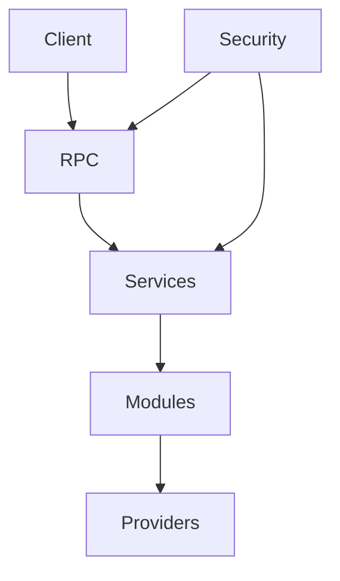

# Architecture Overview

This document describes the high level layering of the application and the security boundaries between them.

* **Client** – User owned frontend or external application.
* **RPC** – Typed boundary that exposes the public namespace. Only bearer tokens are accepted.
* **Services** – Business logic invoked by RPC handlers.
* **Modules** – Internal runtime modules loaded by the server. Modules communicate only through their contracts.
* **Providers** – External systems such as databases and identity services.
* **Security** – Cross cutting layer enforcing authentication, authorization, and privacy rules. Data marked internal never leaves the server.

Internal details (modules, services, providers) are considered **server only** and are never exposed directly to clients. The client interacts solely through the RPC layer with validated tokens.
