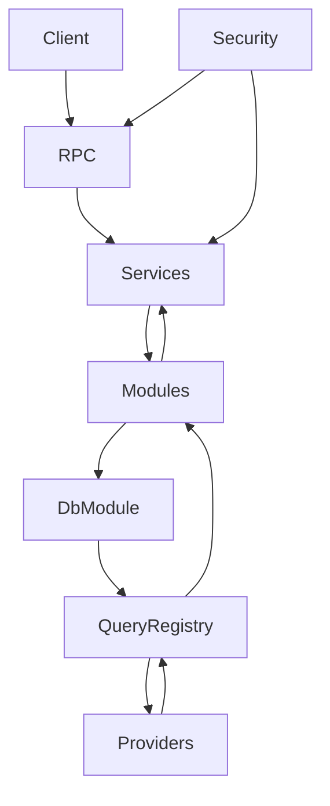

# System Architecture and Security

This document describes the overall system architecture, layered components,
and the security model including role assignments and how RPC namespaces enforce them.

## Layered Architecture

```mermaid
flowchart TD
  Client --> RPC
  RPC --> Services
  Services --> Modules
  Modules --> DbModule
  DbModule --> QueryRegistry
  QueryRegistry --> Providers
  Providers --> QueryRegistry
  QueryRegistry --> Modules
  Modules --> Services
  Security --> RPC
  Security --> Services
```

* **Client** – User owned frontend or external application.
* **RPC** – Typed boundary that exposes the public namespace. Only bearer tokens are accepted.
* **Services** – RPC-facing orchestration that validates/request-shapes and delegates application rules to modules.
* **Modules** – Internal runtime modules loaded by the server and the **application/business logic layer**. Modules make decisions, orchestrate workflows, and enforce application rules. For data access, modules call the `DbModule`/query registry path rather than embedding provider-specific SQL.
* **Query Registry** – Canonical **data-access translation layer** (see `queryregistry/`) that accepts typed requests from modules, maps URN-formatted operations to provider-specific SQL handlers, and returns normalized typed responses. It contains no business logic, conditional workflows, or application rules.
* **Providers** – Connection/transport adapters for external systems such as databases and identity services. Providers own pooling, connectivity, and execution mechanics while queryregistry owns data-access translation and modules own business logic.
* **Security** – Cross cutting layer enforcing authentication, authorization, and privacy rules. Data marked internal never leaves the server.

Layer responsibility rule: **Modules (business logic) → QueryRegistry (data-access translation) → Providers (connection/transport execution)**. Logic flows down this chain; data and results flow back up.

## Security Model

## Input Shim Architecture

External protocols connect to the platform through **input shims** — thin
protocol adapters that authenticate callers and dispatch requests through the
standard RPC handler chain. Input shims contain no business logic. They are
structurally equivalent to the RPC router — they receive, authenticate,
dispatch, and return.

Every input surface — React frontend, Discord bot, TheOracleMCP, future social
integrations — is a different view into the same authoritative backend. See
**INPUT_SHIMS.md** for the full design, constraints, and per-surface details.

| Surface | Transport | Status |
|---------|-----------|--------|
| React frontend | HTTP POST `/rpc` | Production |
| Discord | WebSocket (discord.py) | Production |
| TheOracleMCP | Streamable HTTP `/mcp` | Refactoring |
| Others (Bluesky, TikTok, etc.) | Varies | Planned |

## TheOracleMCP (Agent Input Surface)

The application hosts TheOracleMCP at `/mcp` — a Model Context Protocol server
that provides LLM agents (Claude, Codex) with access to the platform.
TheOracleMCP follows the input shim pattern described above.

### Current State

The MCP tools are wired through the RPC layer. Tool functions resolve auth,
construct an RPC auth context, and dispatch `urn:service:reflection:*`
operations via `dispatch_rpc_op()` under `ROLE_SERVICE_ADMIN`.

### Target Architecture

MCP tools will be thin wrappers that:

1. Authenticate the caller via OAuth 2.1 JWT (issued through TheOracleMCP's
   OAuth consent flow with Microsoft/Google/Discord provider login).
2. Resolve the JWT subject to an internal user GUID and role bitmask via
   `AuthModule.get_user_roles()`.
3. Construct an `RPCRequest` with the resolved auth context.
4. Dispatch through the standard RPC handler chain (`dispatch_rpc_op`).
5. Return the `RPCResponse` payload to the MCP client.

This makes TheOracleMCP structurally identical to the Discord input shim and
the React frontend — all three are presentation layers over the same RPC
boundary.

### Authentication

TheOracleMCP authentication uses OAuth 2.1 with PKCE:

1. Client discovers auth metadata via `/.well-known/oauth-protected-resource`
   and `/.well-known/oauth-authorization-server`.
2. Client initiates authorization code flow with PKCE S256 challenge.
3. User authenticates through a server-rendered consent page using an identity
   provider (Microsoft, Google, or Discord).
4. Server issues a short-lived JWT access token (5 min) and refresh token
   (7 days).
5. JWT contains `sub` (user GUID), `client_id`, scopes, and is signed with
   the application's JWT secret.
6. The user's role bitmask is resolved server-side at dispatch time — JWT
   scopes are not the authorization mechanism, the role bitmask is.

A static `MCP_AGENT_TOKEN` environment variable is supported for development
bootstrapping but grants full access without user identity binding.

### OAuth Infrastructure

| Component | Location |
|-----------|----------|
| Discovery endpoints | `server/routers/oauth_router.py` |
| OAuth consent flow | `server/routers/oauth_router.py` |
| Token issuance & refresh | `server/modules/mcp_gateway_module.py` |
| Client/token storage | `identity.mcp_agents` QueryRegistry subdomain |
| Rate limiting | `McpGatewayModule.SlidingWindowRateLimiter` |
| DCR circuit breaker | `McpGatewayModule._set_dcr_enabled()` |

### Database Tables

| Table | Purpose |
|-------|---------|
| `account_mcp_agents` | Registered MCP clients (client_id, scopes, user binding) |
| `account_mcp_agent_tokens` | Issued access/refresh tokens per agent |
| `account_mcp_auth_codes` | Authorization codes (consumed during token exchange) |

### Available Tools

All tools are currently read-only and idempotent, and dispatch through
`urn:service:reflection:*` RPC operations.

| Tool | Description |
|------|-------------|
| `oracle_list_tables` | List tables from reflection schema catalog |
| `oracle_describe_table` | Columns, indexes, and foreign keys for a table |
| `oracle_list_views` | List views with definitions |
| `oracle_get_full_schema` | Complete schema snapshot |
| `oracle_get_schema_version` | Schema version from system_config |
| `oracle_dump_table` | Export table rows as JSON (bounded) |
| `oracle_query_info_schema` | Query INFORMATION_SCHEMA views (whitelisted) |
| `oracle_list_domains` | Enumerate QueryRegistry domains and operations |
| `oracle_list_rpc_endpoints` | List RPC domain handler names |

### Transport

Streamable HTTP mounted at `/mcp` via Starlette `Route`. Runs in-process
sharing the application's database connection pool. Stateless mode with JSON
responses.

### Role Bit Assignments

This project uses a signed 64‑bit integer to represent security roles and user feature
flags. Bit 63 is unused to avoid the sign bit. High bits define system roles and the
low bits are used for user level flags.

| Bit | Hex Value             | Role Name                 | Notes |
|----:|----------------------:|---------------------------|-------|
| 62  | `0x4000000000000000`  | `ROLE_SERVICE_ADMIN`      | Configure service-wide integrations, keys, and automation. |
| 61  | `0x2000000000000000`  | `ROLE_SYSTEM_ADMIN`       | Access to system configuration features. |
| 60  | `0x1000000000000000`  | `ROLE_FINANCE_ADMIN`      | Configure financial parameters; transactional actions are disallowed and any such attempts are explicitly logged and trigger a manual audit. |
| 59  | `0x0800000000000000`  | `ROLE_ACCOUNT_ADMIN`      | Manage security role definitions and user assignments. |
| 58  | `0x0400000000000000`  | `ROLE_DISCORD_ADMIN`      | Manage Discord personas and integrations. |
| 53  | `0x0020000000000000`  | `ROLE_FINANCE_APPR`       | Approve accounting actions as an accounting manager. |
| 52  | `0x0010000000000000`  | `ROLE_FINANCE_ACCT`       | Perform day-to-day accounting tasks. |
| 49  | `0x0002000000000000`  | `ROLE_MODERATOR`          | Access to moderation tools. |
| 48  | `0x0001000000000000`  | `ROLE_SUPPORT`            | Access to support utilities. |
| 4   | `0x0000000000000010`  | `ROLE_DISCORD_BOT`        | Allow bot-initiated operations from Discord. |
| 3   | `0x0000000000000008`  | `ROLE_LUMAAI_API`         | Access to LumaAI generation features. |
| 2   | `0x0000000000000004`  | `ROLE_OPENAI_API`         | Access to OpenAI generation features. |
| 1   | `0x0000000000000002`  | `ROLE_STORAGE`            | Allows access to the storage domain when explicitly provisioned. |
| 0   | `0x0000000000000001`  | `ROLE_REGISTERED`         | Baseline access to profile and provider management. |

> **Note:** `ROLE_STORAGE` now uses its own bit so that access to the storage domain
> requires explicit provisioning. The discrete role name remains in place because
> RPC namespaces continue to reference it directly.

### Authentication Domains

Understanding the various domains and where values are used and stored is vital to the
stability of the application.

#### Provider Domain

The authentication provider is a client-side domain. The client libraries (e.g. MSAL)
obtain tokens that validate the user's identity against public JWKS. Four pieces of
data are passed to the app:

1. User's unique identifier
2. User's email address or primary username
3. User's profile image
4. User's display name

#### Application Domain

The user's local session on a device. This session includes a bearer token which
identifies the unique session and device. When a request is made the bearer token is
decoded and security is looked up in the back end. If authorized, the RPC transaction
continues. The client retains only this bearer token containing the user's randomly
assigned GUID, session GUID, and device GUID; no personal details are included.

#### Server Domain

The backend server handles all requests. The server domain includes the database and
retains:

1. User's unique account identifier
2. User's email address*
3. User's unique session and device identifier
4. User's profile image (if available)

*Email addresses are required for purchase receipts and cannot be removed. Users may
share their address in their public profile, the service sends no other email communications.

#### Account Provisioning

Accounts can only be created through trusted identity providers (**Microsoft**, **Google**,
**Discord**, and **Apple**). No local credentials are ever issued or stored. When a user
signs in for the first time, the provider identifier becomes associated with a unique 
internal identifier. Additional provider identities can also be linked to your identifier.

#### Authentication Workflow

1. Client obtains an ID token from an identity provider.
2. Token is sent to the server and validated against the provider's JWKS.
3. For new accounts a GUID is generated and the provider becomes the user's default provider.
4. Existing accounts are looked up by GUID and their session/device records are refreshed.
5. A server-signed bearer token is returned to the client and used for all RPC calls.

#### Personal Data and Privacy

The server stores only minimal personal information:

* GUID (internal identifier)
* Email address *(required; used only for purchase receipts)*
* Profile image *(optional)*
* Display name *(editable)*

#### Provider Association

Each account is linked to a single default provider for communication and auditing. Identity
provider data is not used in internal cryptographic operations; it is only used to
validate the user's identity token during authentication. All encryption and signing
routines rely solely on internal keys.

### RPC Namespace Integration

Every RPC call must include a server-issued bearer token. Anonymous requests are limited
to the `public.*` and `auth.*` namespaces. All other namespaces require a security lookup
and the appropriate role:

| RPC Domain | Required Role |
|------------|---------------|
| `support.*` | `ROLE_SUPPORT` |
| `users.*` | `ROLE_REGISTERED` |
| `storage.*` | `ROLE_STORAGE` |
| `system.*` | `ROLE_SYSTEM_ADMIN` |
| `service.*` | `ROLE_SERVICE_ADMIN` |
| `account.*` | `ROLE_ACCOUNT_ADMIN` |
| `moderation.*` | `ROLE_MODERATOR` |
| `discord.*` | Role mapped via `system_roles.element_rpc_domain` (currently `ROLE_DISCORD_ADMIN`) |
| `finance.*` | `ROLE_FINANCE_ADMIN` (with operation-level exceptions; see `RPC.md`) |

The RPC layer decrypts the bearer token to extract the user's GUID, builds an
`RPCRequest`, validates roles, credits, and entitlements, and then dispatches the
operation if authorized.
