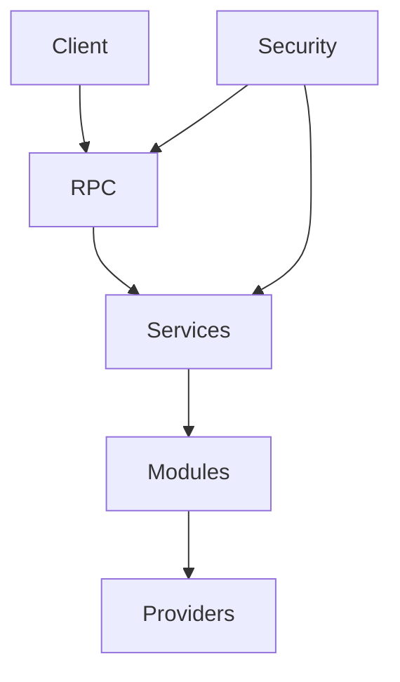

# System Architecture and Security

This document describes the overall system architecture, layered components,
and the security model including role assignments and how RPC namespaces enforce them.

## Layered Architecture

```mermaid
flowchart TD
  Client --> RPC
  RPC --> Services
  Services --> Modules
  Modules --> Providers
  Security --> RPC
  Security --> Services
```

* **Client** – User owned frontend or external application.
* **RPC** – Typed boundary that exposes the public namespace. Only bearer tokens are accepted.
* **Services** – Business logic invoked by RPC handlers.
* **Modules** – Internal runtime modules loaded by the server. Modules communicate only through their contracts.
* **Providers** – External systems such as databases and identity services.
* **Security** – Cross cutting layer enforcing authentication, authorization, and privacy rules. Data marked internal never leaves the server.

### Enforcement Mechanics

* **Ingress discipline** – `main.py` wires a single FastAPI router at `/rpc`. The handler in `rpc/handler.py` validates URN syntax and rejects any request with an unexpected domain before reaching business logic.
* **Two-phase module initialization** – `ModuleManager` imports every `_module.py`, constructs the associated `BaseModule` subclass, and exposes its RPC-safe facade through `app.state.services`. Modules block on `on_ready()` before dependent modules can use them, guaranteeing fail-safe startup.
* **Provider verification** – The registry loads provider bindings and invokes `verify_provider_coverage()` so database/auth providers cannot mark themselves ready without concrete implementations for each declared contract.

## RPC Ingress Contract

* All external calls flow through a single FastAPI ingress mounted at `/rpc`. The router performs no branching logic; every request is handed directly to the RPC dispatcher for validation and dispatch.
* The dispatcher validates the RPC URN structure before routing. Requests must include the `urn:` prefix, domain, subsystem, function, and version segments. Invalid or unknown domains are rejected with structured `rpc.bad_request` or `rpc.not_found` errors.
* Registry routes are registered alongside provider bindings. The registry verifies that every `db:` contract has a callable implementation before the provider is marked ready, preventing runtime gaps between modules and SQL providers.

## Logging and Request Correlation

* Each RPC request receives a server-generated `request_id` during request unpacking.
* The `request_id` propagates through RPC handlers, modules, providers, and database helpers via contextual metadata.
* All log statements at those boundaries must include the `request_id` to provide end-to-end traceability. Security-sensitive events additionally emit audit logs tagged with the RPC operation and identity source.
* Providers are responsible for translating internal exceptions into structured RPC errors so diagnostic context is logged while the client receives a user-safe message. Registry start-up will fail fast if a provider omits handlers so missing telemetry cannot silently skip logging.
* Root logging is configured by `server.helpers.logging.configure_root_logging`. The helper suppresses Discord SDK noise, forwards warnings/errors to stdout, and optionally mirrors logs into Discord via a hardened handler that reports transmission failures instead of silently dropping them.

## Security Model

### Role Bit Assignments

This project uses a signed 64‑bit integer to represent security roles and user feature
flags. Bit 63 is unused to avoid the sign bit. High bits define privileged
administrative access, while the low bits hold end-user feature flags. The current
database configuration exposes the following roles and masks:

| Hex Value             | Role Name                 | Display Name         | Responsibilities |
|----------------------:|---------------------------|----------------------|------------------|
| `0x4000000000000000`  | `ROLE_SERVICE_ADMIN`      | Service Admin        | Maintains security role definitions and full service configuration, including provider credentials and infrastructure wiring. |
| `0x2000000000000000`  | `ROLE_SYSTEM_ADMIN`       | System Admin         | Operates the platform runtime and system level features. |
| `0x1000000000000000`  | `ROLE_FINANCE_ADMIN`      | Finance Admin        | Configures finance modules; every action is logged and flagged for audit review. |
| `0x0800000000000000`  | `ROLE_ACCOUNT_ADMIN`      | Account Admin        | Manages user accounts and role assignments; does not alter security role definitions. |
| `0x0400000000000000`  | `ROLE_DISCORD_ADMIN`      | Discord Admin        | Administers Discord personas and integration bindings. |
| `0x0002000000000000`  | `ROLE_MODERATOR`          | Moderator            | Uses moderation tooling to enforce community policy. |
| `0x0001000000000000`  | `ROLE_SUPPORT`            | Support              | Accesses support tooling for customer assistance. |
| `0x0000000000000020`  | `ROLE_FINANCE_APPR`       | Accounting Manager   | Approves journal entries and postings to enforce GAAP-compliant separation of duties. |
| `0x0000000000000010`  | `ROLE_FINANCE_ACCT`       | Accountant           | Captures transactions, sales, purchasing, and inventory movements. |
| `0x0000000000000008`  | `ROLE_DISCORD_BOT`        | Discord Bot          | Machine identity used by the Discord bridge. |
| `0x0000000000000004`  | `ROLE_LUMAAI_API`         | LumaAI Generation    | Enables access to LumaAI powered generation workflows. |
| `0x0000000000000002`  | `ROLE_OPENAI_API`         | OpenAI Generation    | Enables access to OpenAI powered generation workflows. |
| `0x0000000000000001`  | `ROLE_STORAGE`            | Storage Enabled      | Grants access to the storage domain for asset management. |
| `0x0000000000000001`  | `ROLE_REGISTERED`         | Registered User      | Baseline entitlement assigned to every authenticated account. |

Finance roles (`ROLE_FINANCE_ACCT`, `ROLE_FINANCE_APPR`, and `ROLE_FINANCE_ADMIN`) are
structured to provide a minimal separation-of-duties model that aligns with GAAP. The
accountant role can capture and edit financial activity, the approver/manager role
authorizes postings, and the finance administrator configures ledgers, tax rules, and
reporting integration. Administrative actions are audited to ensure the finance
surface remains fail-safe and tamper evident. Service administrators curate the
canonical role definitions while account administrators focus on assigning those
approved roles to individual users.

### Authentication Domains

Understanding the various domains and where values are used and stored is vital to the
stability of the application.

#### Provider Domain

The authentication provider is a client-side domain. The client libraries (e.g. MSAL)
obtain tokens that validate the user's identity against public JWKS. Four pieces of
data are passed to the app:

1. User's unique identifier
2. User's email address or primary username
3. User's profile image
4. User's display name

#### Application Domain

The user's local session on a device. This session includes a bearer token which
identifies the unique session and device. When a request is made the bearer token is
decoded and security is looked up in the back end. If authorized, the RPC transaction
continues. The client retains only this bearer token containing the user's randomly
assigned GUID, session GUID, and device GUID; no personal details are included.

#### Server Domain

The backend server handles all requests. The server domain includes the database and
retains:

1. User's unique account identifier
2. User's email address*
3. User's unique session and device identifier
4. User's profile image (if available)

*Email addresses are required for purchase receipts and cannot be removed. Users may
share their address in their public profile, the service sends no other email communications.

#### Account Provisioning

Accounts can only be created through trusted identity providers (**Microsoft**, **Google**,
**Discord**, and **Apple**). No local credentials are ever issued or stored. When a user
signs in for the first time, the provider identifier becomes associated with a unique 
internal identifier. Additional provider identities can also be linked to your identifier.

#### Authentication Workflow

1. Client obtains an ID token from an identity provider.
2. Token is sent to the server and validated against the provider's JWKS.
3. For new accounts a GUID is generated and the provider becomes the user's default provider.
4. Existing accounts are looked up by GUID and their session/device records are refreshed.
5. A server-signed bearer token is returned to the client and used for all RPC calls.

#### Personal Data and Privacy

The server stores only minimal personal information:

* GUID (internal identifier)
* Email address *(required; used only for purchase receipts)*
* Profile image *(optional)*
* Display name *(editable)*

#### Provider Association

Each account is linked to a single default provider for communication and auditing. Identity
provider data is not used in internal cryptographic operations; it is only used to
validate the user's identity token during authentication. All encryption and signing
routines rely solely on internal keys.

### RPC Namespace Integration

Every RPC call must include a server-issued bearer token. Anonymous requests are limited
to the `public.*` and `auth.*` namespaces. All other namespaces require a security lookup
and the appropriate role:

| RPC Domain | Required Role |
|------------|---------------|
| `support.*` | `ROLE_SUPPORT` |
| `users.*` | `ROLE_REGISTERED` |
| `storage.*` | `ROLE_STORAGE` |
| `system.*` | `ROLE_SYSTEM_ADMIN` |
| `service.*` | `ROLE_SERVICE_ADMIN` |
| `account.*` | `ROLE_ACCOUNT_ADMIN` |
| `moderation.*` | `ROLE_MODERATOR` |

The RPC layer decrypts the bearer token to extract the user's GUID, builds an
`RPCRequest`, validates roles, credits, and entitlements, and then dispatches the
operation if authorized.

## Session Persistence Design Updates (v0.7.2 proposal)

### Rotation key usage

* `account_users.element_rotkey` remains a per-user, semi-long-lived salt that never leaves the database layer in raw form.
* Access, refresh, and device tokens are derived or hashed using the rotation key plus per-device entropy so the key acts solely as a salt and compromise of a single bearer token does not reveal the salt material.
* Server code MUST NOT treat the rotation key as a refresh token nor transmit it to clients. Any legacy code doing so must be migrated to the new per-device storage described below.

### Per-device refresh token storage

* Introduce a `sessions_refresh_tokens` table keyed by `sessions_devices.element_guid` to persist the hashed refresh token that corresponds to each active device.
* Columns include the hashed token, `issued_at`, `expires_at`, `revoked_at`, and standard audit timestamps. The hash process should combine the bearer token with the user’s rotation key to ensure unusable raw values even if the table is exposed.
* Security views such as `vw_user_session_security` and `vw_account_user_security` join through `sessions_devices` to this new table rather than surfacing the rotation key directly.
* Session creation, refresh, and revocation paths write and read through the registry helpers so each device rotates independently without mutating other device rows.

### Session activity history

* A `session_activity_log` table captures every issuance, refresh, and revocation with `activity_guid`, `session_guid`, `device_guid`, `activity_type`, correlated `request_id` or `activity_id`, IP address, user agent, optional metadata JSON, and timestamp columns.
* Registry helpers append an activity record whenever a session mutation occurs. Modules pass contextual data (request ID, Discord payload, etc.) so operators can audit device behavior and trace anomalies.
* Provide a read-optimized view that joins sessions, devices, users, and activity rows for operational dashboards.

### Request and Discord metadata auditing

* Persist request metadata in a `system_request_audit` table keyed by `request_id` with optional `activity_id`, RPC operation, identity source, session/device GUIDs, Discord identifiers, outcome status, error codes, and metadata JSON.
* Core RPC services and Discord adapters insert rows into this table so workflow automation and security reviews share a single source of truth.
* Index the audit table by request, activity, and Discord identifiers to support cross-system correlation, and expose a reporting view to join with session history for deep forensic investigations.

## Exception Handling Standards

* Raise `server.errors.RPCServiceError` (or one of the helper factories such as `bad_request` or `forbidden`) for all expected failure cases so RPC clients receive typed, localized responses.
* Never suppress `Exception` instances. Catch-and-log flows must emit warning or error logs with the correlated `request_id` and re-raise unless a fallback is explicitly documented. Helper utilities (for example Discord log mirroring) should propagate context and mark degraded modes clearly in telemetry.
* Use FastAPI exception handlers only to transform framework-level errors into structured RPC responses. Avoid wrapping imports or module initialization with blanket `try/except` blocks—let start-up fail fast and surface the diagnostic message in logs.

