# Authentication Workflow Diagrams

This document captures the authentication workflows in layered diagrams. Each workflow is shown with a layered architecture view and per-layer sequence diagrams that stop at provider contracts.

## Session Token Issuance (`auth.session.get_token`)

### Layered Architecture
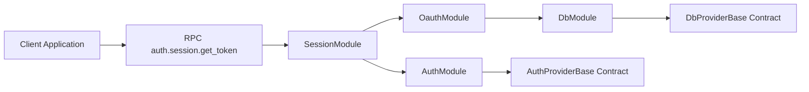

### RPC Layer Sequence
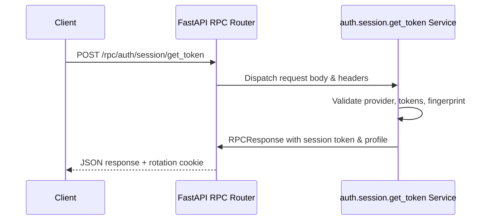

### Server Module Layer Sequence
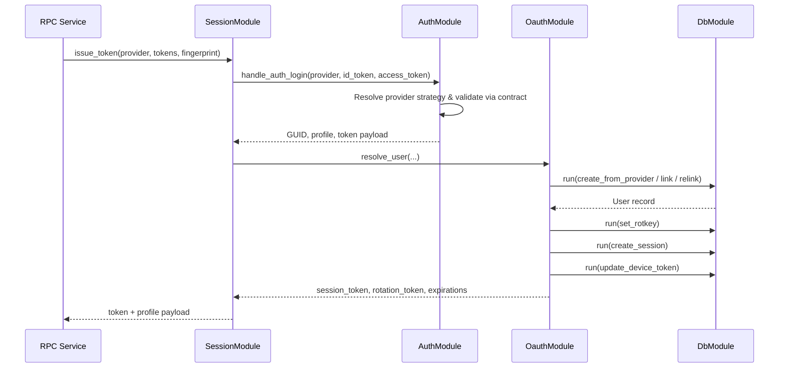

### Provider Layer Sequence
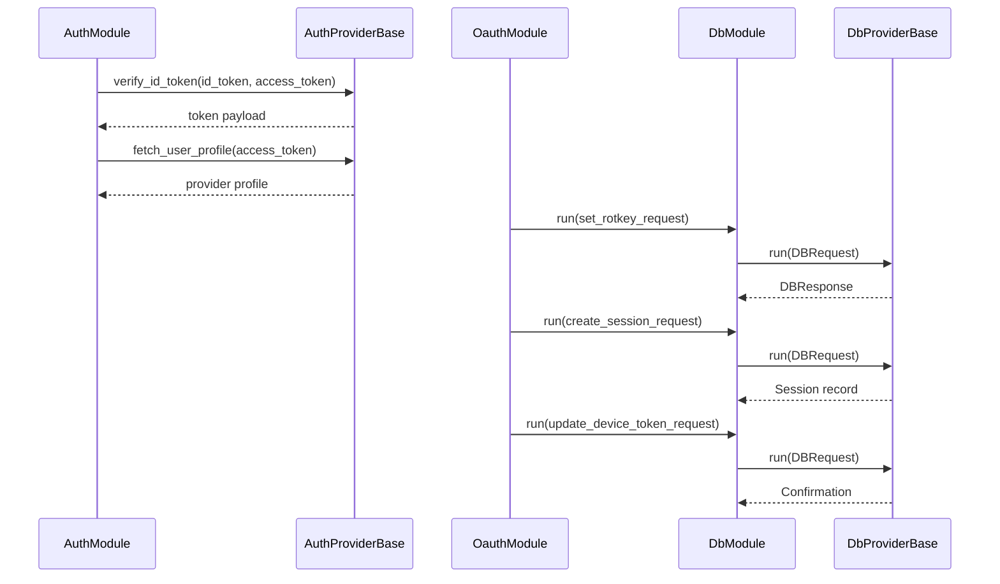

## Session Token Refresh (`auth.session.refresh_token`)

### Layered Architecture
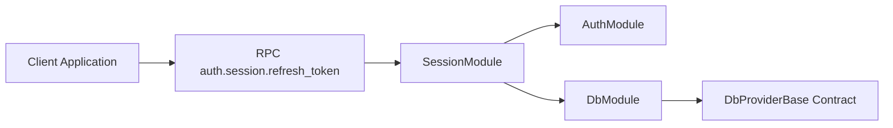

### RPC Layer Sequence
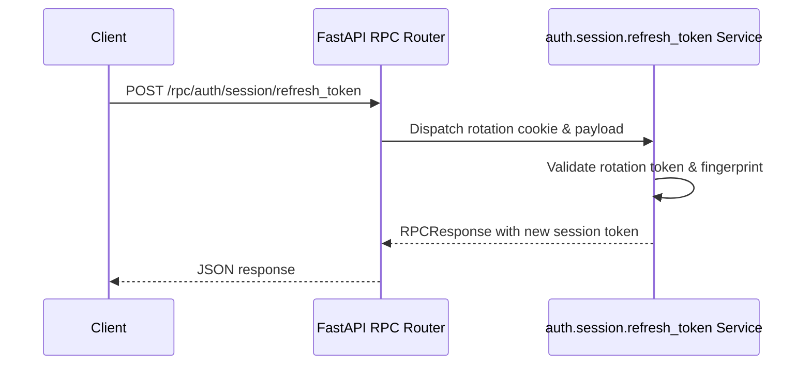

### Server Module Layer Sequence
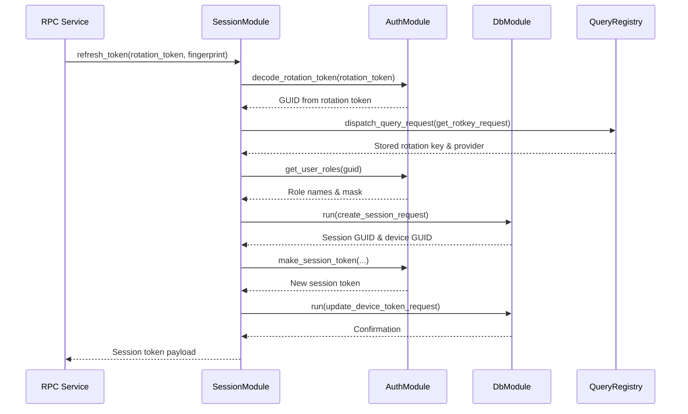

### Provider Layer Sequence
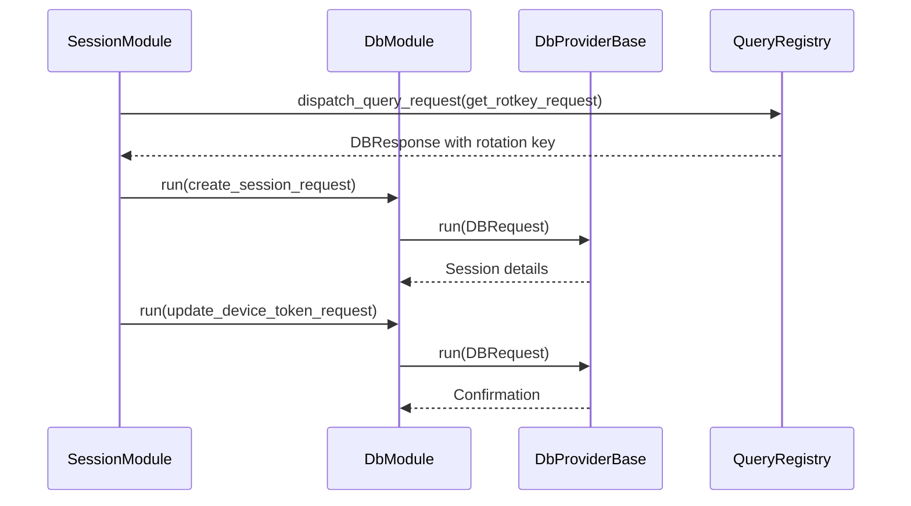

## Session Invalidation (`auth.session.invalidate_token`)

### Layered Architecture
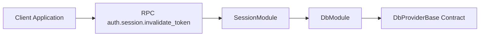

### RPC Layer Sequence
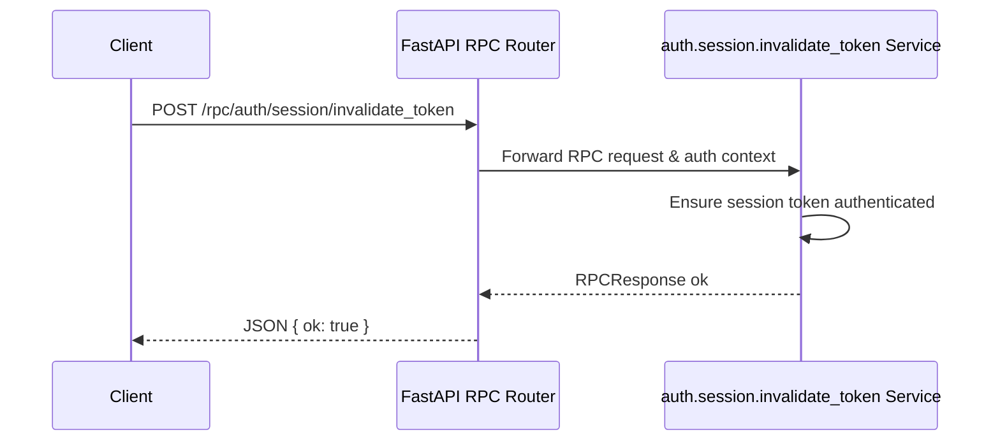

### Server Module Layer Sequence
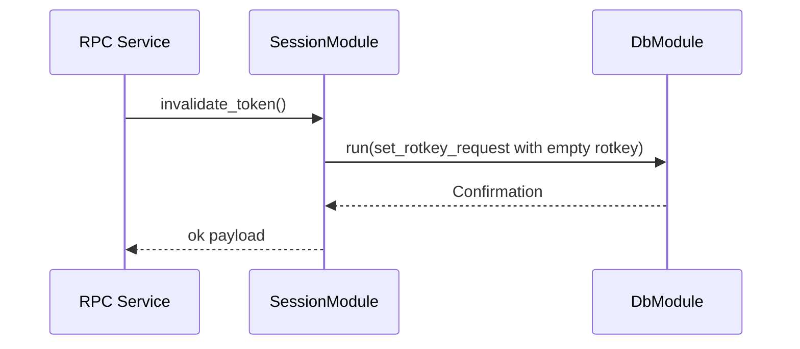

### Provider Layer Sequence
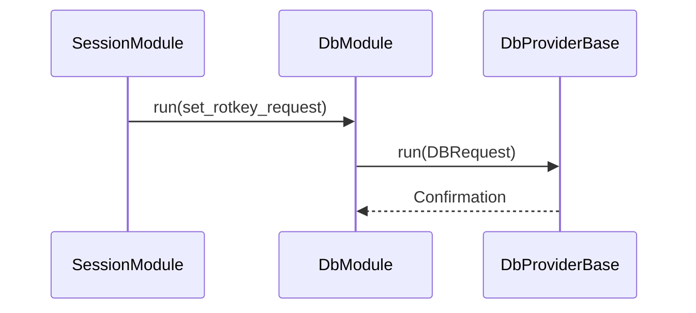

## Device Logout (`auth.session.logout_device`)

### Layered Architecture
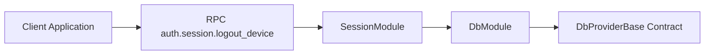

### RPC Layer Sequence
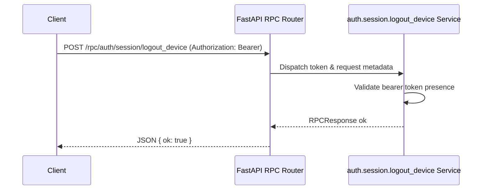

### Server Module Layer Sequence
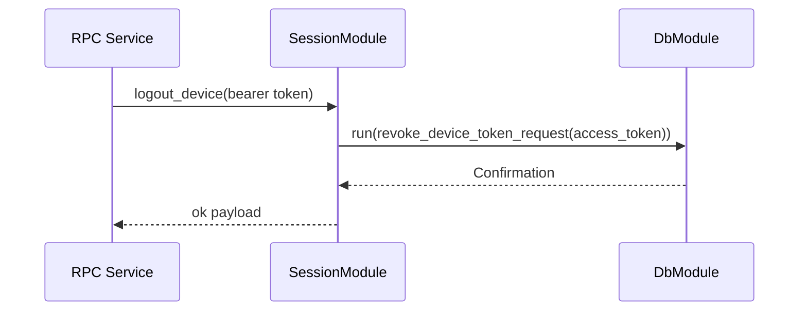

### Provider Layer Sequence
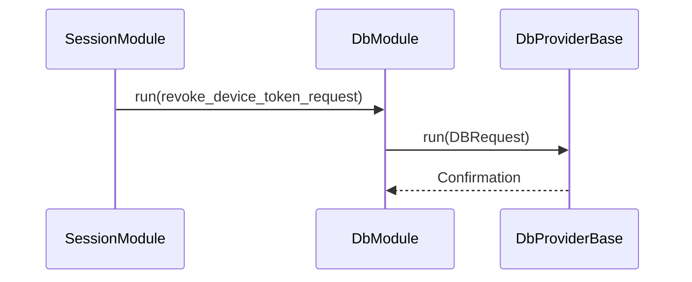

## Session Inspection (`auth.session.get_session`)

### Layered Architecture
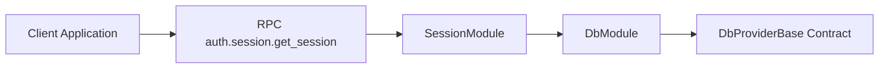

### RPC Layer Sequence
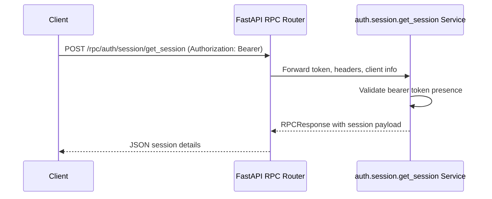

### Server Module Layer Sequence
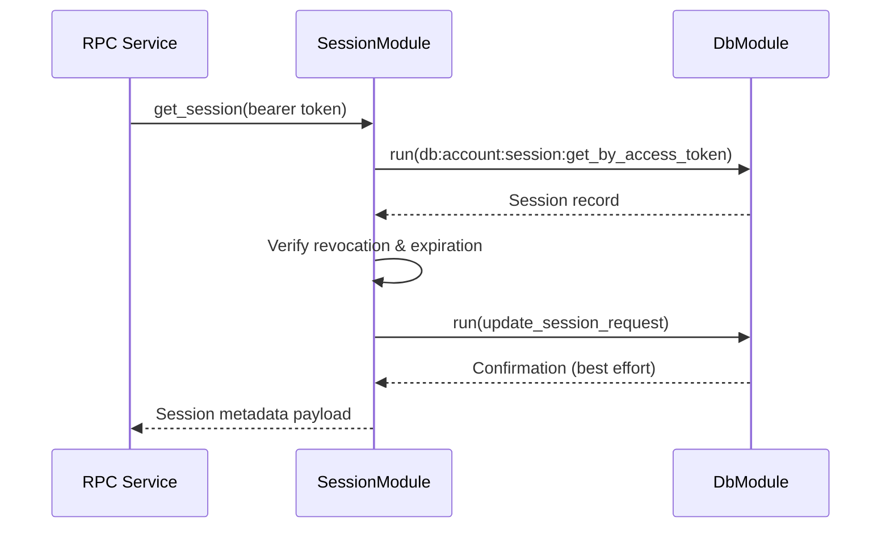

### Provider Layer Sequence
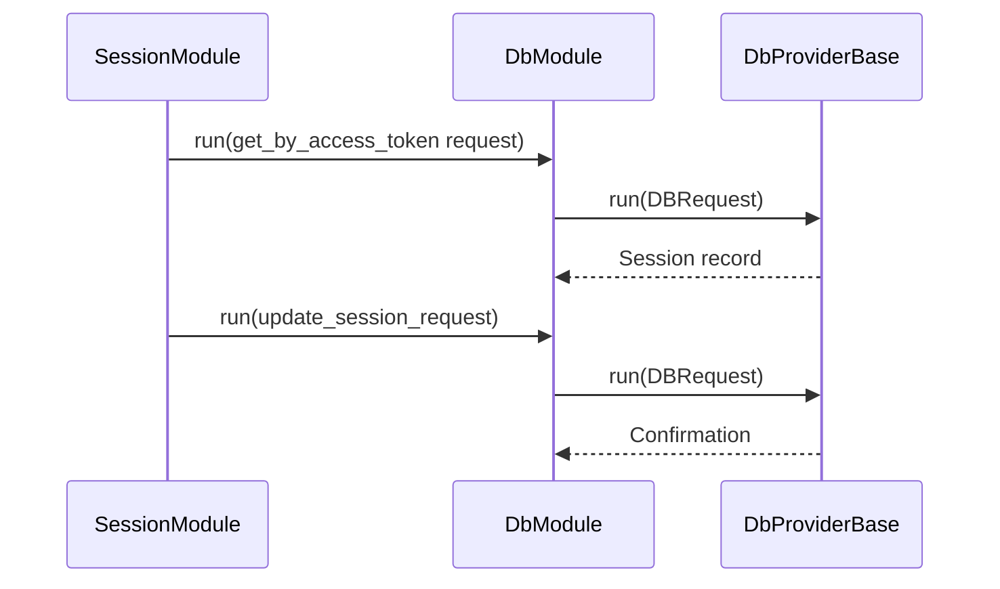
