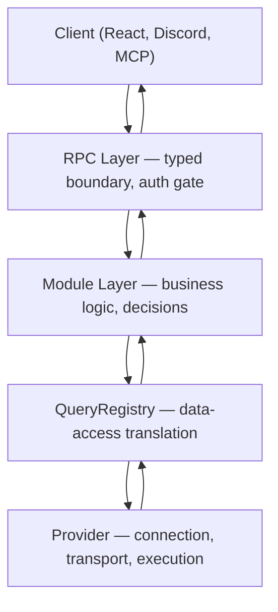
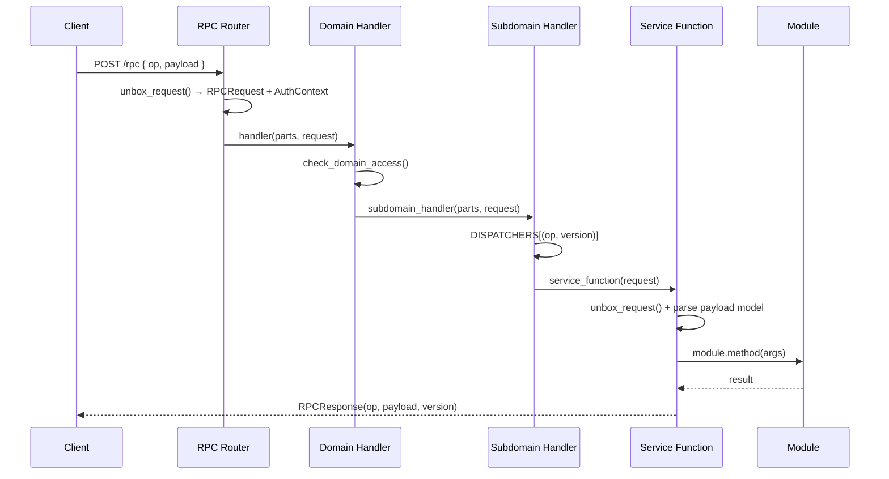
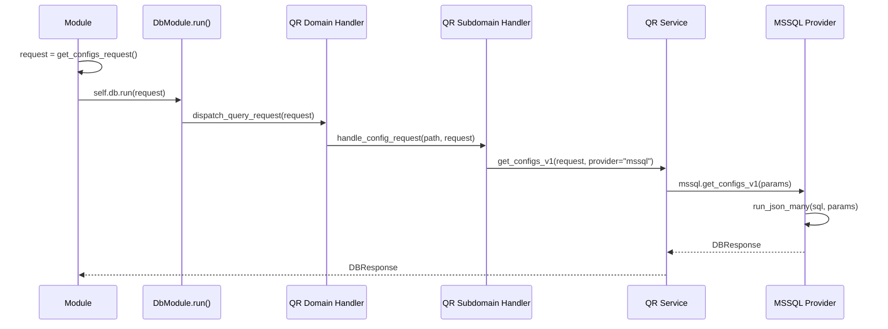
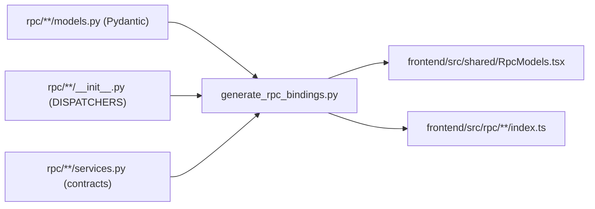
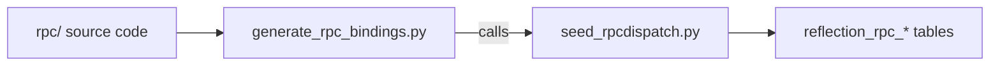

# TheOracleRPC — Patterns Reference

LLM-optimized context document. Every section defines a structural pattern with a diagram and canonical code example extracted from the working codebase.

---

## 1. Layer Architecture



Each layer has a single responsibility:

| Layer | Responsibility |
|---|---|
| **Client** | Presentation. Sends typed RPC requests, renders responses. Zero business logic. |
| **RPC** | Security gate. Validates bearer tokens, checks role bitmasks, dispatches to modules. |
| **Module** | Application logic. Makes decisions, orchestrates workflows, enforces business rules. |
| **QueryRegistry** | Data-access translation. Maps canonical operation names to provider-specific SQL. Zero business logic. |
| **Provider** | Connection and transport. Pool management, transaction boundaries, raw execution. |

Maintain layer boundary discipline: each layer calls only the layer directly below it.

---

## 2. RPC Dispatch Pattern

### 2.1 Request Flow



### 2.2 URN Format

```
urn:{domain}:{subsystem}:{operation}:{version}
```

Examples: `urn:system:config:get_configs:1`, `urn:finance:journals:create:1`

### 2.3 Subdomain __init__.py — Dispatcher Registration

```python
from .services import (
  system_config_delete_config_v1,
  system_config_get_configs_v1,
  system_config_upsert_config_v1,
)

DISPATCHERS: dict[tuple[str, str], callable] = {
  ("get_configs", "1"): system_config_get_configs_v1,
  ("upsert_config", "1"): system_config_upsert_config_v1,
  ("delete_config", "1"): system_config_delete_config_v1,
}
```

### 2.4 Subdomain handler.py — Operation Routing

```python
from fastapi import HTTPException, Request
from server.models import RPCResponse
from . import DISPATCHERS

async def handle_config_request(parts: list[str], request: Request) -> RPCResponse:
  key = tuple(parts[:2])
  handler = DISPATCHERS.get(key)
  if not handler:
    raise HTTPException(status_code=404, detail='Unknown RPC operation')
  return await handler(request)
```

### 2.5 Subdomain models.py — Pydantic Request/Response Models

```python
from pydantic import BaseModel

class SystemConfigConfigItem1(BaseModel):
  key: str
  value: str

class SystemConfigList1(BaseModel):
  items: list[SystemConfigConfigItem1]

class SystemConfigDeleteConfig1(BaseModel):
  key: str
```

Model naming convention: `{Domain}{Subdomain}{Operation}{Version}` in PascalCase.

### 2.6 Subdomain services.py — Service Functions

The RPC service layer is a security router. It authenticates, authorizes, dispatches to the module, and returns the response. All data transformation lives in the module. The service function contains zero business logic and zero data reshaping.

```python
from fastapi import Request
from rpc.helpers import unbox_request
from server.models import RPCResponse
from typing import TYPE_CHECKING

if TYPE_CHECKING:
  from server.modules.system_config_module import SystemConfigModule

from .models import SystemConfigConfigItem1

async def system_config_get_configs_v1(request: Request):
  rpc_request, auth_ctx, _ = await unbox_request(request)

  module: SystemConfigModule = request.app.state.system_config
  await module.on_ready()

  result = await module.get_configs(auth_ctx.user_guid, auth_ctx.roles)
  return RPCResponse(
    op=rpc_request.op,
    payload=result.model_dump(),
    version=rpc_request.version,
  )

async def system_config_upsert_config_v1(request: Request):
  rpc_request, auth_ctx, _ = await unbox_request(request)
  input_payload = SystemConfigConfigItem1(**(rpc_request.payload or {}))

  module: SystemConfigModule = request.app.state.system_config
  await module.on_ready()

  result = await module.upsert_config(
    auth_ctx.user_guid,
    auth_ctx.roles,
    input_payload.key,
    input_payload.value,
  )
  return RPCResponse(
    op=rpc_request.op,
    payload=result.model_dump(),
    version=rpc_request.version,
  )
```

Service function structure:
1. `unbox_request(request)` — always first, exactly once
2. Parse input payload into typed Pydantic model (when operation accepts input)
3. Resolve module from `request.app.state.{module_attr}`
4. `await module.on_ready()`
5. Call module method — the module returns the typed Pydantic response model directly
6. Return `RPCResponse(op, result.model_dump(), version)` — pass through, no transformation

The module owns the response contract. It returns the exact Pydantic model that becomes the client payload. The service function is fully generatable from the `reflection_rpc_functions` table, which stores the module attr, method name, request model GUID, and response model GUID for every operation.

### 2.7 Domain Handler — Subdomain Routing with Auth Check

```python
from fastapi import HTTPException, Request
from rpc.helpers import unbox_request
from server.models import RPCResponse
from server.modules.auth_module import AuthModule
from . import HANDLERS

async def handle_system_request(parts: list[str], request: Request) -> RPCResponse:
  _, auth_ctx, _ = await unbox_request(request)
  if not parts:
    raise HTTPException(status_code=404, detail="Unknown RPC subdomain")

  auth: AuthModule = request.app.state.auth
  await auth.check_domain_access("system", auth_ctx.user_guid)

  handler = HANDLERS.get(parts[0])
  if not handler:
    raise HTTPException(status_code=404, detail="Unknown RPC subdomain")
  return await handler(parts[1:], request)
```

### 2.8 Domain __init__.py — Subdomain Registration

```python
from .config.handler import handle_config_request
from .roles.handler import handle_roles_request

HANDLERS: dict[str, callable] = {
  "config": handle_config_request,
  "roles": handle_roles_request,
}
```

---

## 3. Module Lifecycle Pattern

### 3.1 Module Discovery

Files: `snake_case_module.py` → Class: `CamelCaseModule`

The `ModuleManager` auto-discovers all `*_module.py` files in `server/modules/`, instantiates the matching `CamelCaseModule` class, and registers it on `app.state.{module_name}` (where `module_name` is the filename without `_module.py`).

Example: `system_config_module.py` → `SystemConfigModule` → `app.state.system_config`

### 3.2 Module Structure

The module owns the response contract. It accepts typed input, performs all business logic and data transformation, and returns the exact Pydantic model that becomes the client payload.

```python
from __future__ import annotations
from fastapi import FastAPI
from . import BaseModule
from .db_module import DbModule
from rpc.system.config.models import SystemConfigConfigItem1, SystemConfigList1

class SystemConfigModule(BaseModule):
  def __init__(self, app: FastAPI):
    super().__init__(app)
    self.db: DbModule | None = None

  async def startup(self):
    self.db = self.app.state.db
    await self.db.on_ready()
    self.mark_ready()

  async def shutdown(self):
    self.db = None

  async def get_configs(self, user_guid: str, roles: list[str]) -> SystemConfigList1:
    res = await self.db.run(get_configs_request())
    items = [
      SystemConfigConfigItem1(
        key=row.get("element_key", ""),
        value=row.get("element_value", ""),
      )
      for row in res.rows
    ]
    return SystemConfigList1(items=items)
```

Module lifecycle:
1. `__init__(app)` — store app reference, initialize fields to None
2. `startup()` — resolve dependencies via `self.app.state`, await their `on_ready()`, then call `self.mark_ready()`
3. Business methods — all data access through `self.db.run(request_builder())`, return the RPC response Pydantic model directly
4. `shutdown()` — release references

### 3.3 Model Ownership

Modules return the RPC response Pydantic model (`rpc/**/models.py`) directly. This is the typed contract that flows to the client. The service function passes it through without transformation.

Module-internal Pydantic models (`server/modules/models/`) are reserved for cross-module data exchange where no RPC model exists — internal coordination types that are shared between modules but never exposed to clients. All typed models throughout the system are Pydantic `BaseModel` subclasses.

---

## 4. QueryRegistry Dispatch Pattern

### 4.1 Data Flow



### 4.2 Operation Naming Contract

```
db:{domain}:{subdomain}:{operation}:{version}
```

Examples: `db:system:config:list:1`, `db:finance:journals:create:1`

### 4.3 QR Subdomain __init__.py — Request Builders

Request builders are the module-facing API. They construct `DBRequest` objects with the canonical operation name:

```python
from queryregistry.models import DBRequest
from .models import ConfigKeyParams, UpsertConfigParams

def get_configs_request() -> DBRequest:
  return DBRequest(op="db:system:config:list:1", payload={})

def upsert_config_request(params: UpsertConfigParams) -> DBRequest:
  return DBRequest(op="db:system:config:upsert:1", payload=params.model_dump())

def delete_config_request(params: ConfigKeyParams) -> DBRequest:
  return DBRequest(op="db:system:config:delete:1", payload=params.model_dump())
```

### 4.4 QR Subdomain models.py — Typed Parameters

```python
from pydantic import BaseModel, ConfigDict

class ConfigKeyParams(BaseModel):
  model_config = ConfigDict(extra="forbid")
  key: str

class UpsertConfigParams(BaseModel):
  model_config = ConfigDict(extra="forbid")
  key: str
  value: str
```

QR parameter models use `ConfigDict(extra="forbid")` to reject unexpected fields at the data-access boundary.

### 4.5 QR Subdomain handler.py — Operation Dispatch

```python
from queryregistry.dispatch import dispatch_subdomain_request
from queryregistry.models import DBRequest, DBResponse
from .services import get_configs_v1, upsert_config_v1, delete_config_v1

DISPATCHERS: dict[tuple[str, str], SubdomainDispatcher] = {
  ("list", "1"): get_configs_v1,
  ("upsert", "1"): upsert_config_v1,
  ("delete", "1"): delete_config_v1,
}

async def handle_config_request(path, request, *, provider):
  return await dispatch_subdomain_request(
    path, request, provider=provider,
    dispatchers=DISPATCHERS, detail="Unknown system config operation",
  )
```

### 4.6 QR Subdomain services.py — Provider Dispatch

```python
from queryregistry.models import DBRequest, DBResponse
from . import mssql
from .models import UpsertConfigParams

_UPSERT_DISPATCHERS: dict[str, _Dispatcher] = {"mssql": mssql.upsert_config_v1}

async def upsert_config_v1(request: DBRequest, *, provider: str) -> DBResponse:
  params = UpsertConfigParams.model_validate(request.payload)
  result = await _select_dispatcher(provider, _UPSERT_DISPATCHERS)(params.model_dump())
  return DBResponse(op=request.op, payload=result.payload, rowcount=result.rowcount)
```

### 4.7 QR Subdomain mssql.py — SQL Execution

```python
from queryregistry.providers.mssql import run_exec, run_json_many, run_json_one

async def get_configs_v1(_):
  sql = """
    SELECT element_key, element_value
    FROM system_config
    ORDER BY element_key
    FOR JSON PATH;
  """
  return await run_json_many(sql)

async def upsert_config_v1(args):
  sql = """
    MERGE system_config AS target
    USING (SELECT ? AS element_key, ? AS element_value) AS src
    ON target.element_key = src.element_key
    WHEN MATCHED THEN
      UPDATE SET element_value = src.element_value
    WHEN NOT MATCHED THEN
      INSERT (element_key, element_value)
      VALUES (src.element_key, src.element_value);
  """
  return await run_exec(sql, (args["key"], args["value"]))
```

### 4.8 MSSQL Provider Helpers

| Helper | Purpose |
|---|---|
| `run_exec(sql, params)` | Fire-and-forget DML (INSERT/UPDATE/DELETE) |
| `run_json_one(sql, params)` | Single-row JSON result (`FOR JSON PATH, WITHOUT_ARRAY_WRAPPER`) |
| `run_json_many(sql, params)` | Multi-row JSON result (`FOR JSON PATH`) |
| `run_rows_one(sql, params)` | Single row as dict |
| `run_rows_many(sql, params)` | Multiple rows as list[dict] |

---

## 5. Data Conventions
 
### 5.1 Extended Data Types (EDT)
 
All column types conform to the EDT mapping table (`system_edt_mappings`). Query MCP tool `oracle_dump_table` with `table_name=system_edt_mappings` for live values.
 
| recid | Name | MSSQL | PostgreSQL | MySQL | Python | Notes |
|---|---|---|---|---|---|---|
| 1 | INT32 | `int` | `integer` | `int` | `int` | Standard 32-bit signed integer |
| 2 | INT64 | `bigint` | `bigint` | `bigint` | `int` | Standard 64-bit signed integer |
| 3 | INT64_IDENTITY | `bigint identity(1,1)` | `bigserial` | `bigint auto_increment` | `int` | Auto-numbering primary key |
| 4 | UUID | `uniqueidentifier` | `uuid` | `char(36)` | `UUID` | GUID with `newid()` default |
| 5 | BOOL | `bit` | `boolean` | `boolean` | `bool` | 0/1 boolean |
| 7 | DATETIME_TZ | `datetimeoffset(7)` | `timestamptz` | `timestamp` | `datetime` | Timezone-aware, `SYSUTCDATETIME()` default |
| 8 | STRING | `nvarchar` | `varchar` | `varchar` | `str` | Bounded Unicode string, use `element_max_length` |
| 9 | TEXT | `nvarchar(max)` | `text` | `longtext` | `str` | Unbounded text payload |
| 11 | INT8 | `tinyint` | `smallint` | `tinyint` | `int` | Unsigned 8-bit (0-255), used for lookup FKs |
| 12 | DATE | `date` | `date` | `date` | `date` | Calendar date, no timezone |
| 13 | DECIMAL_19_5 | `decimal(19,5)` | `numeric(19,5)` | `decimal(19,5)` | `Decimal` | Financial amount, quantized to 4dp before posting |
| 14 | DECIMAL_28_12 | `decimal(28,12)` | `numeric(28,12)` | `decimal(28,12)` | `Decimal` | High-precision staging, preserves provider precision |
| 15 | JSON | `nvarchar(max)` | `jsonb` | `json` | `dict` | JSON document stored as text |

### 5.2 Column Naming

- `recid` — `bigint identity(1,1)` primary key
- `element_guid` — `uniqueidentifier` with `DEFAULT newid()`
- `element_*` — all metadata and business columns
- `element_created_on` — `datetimeoffset(7)` with `DEFAULT SYSUTCDATETIME()`
- `element_modified_on` — `datetimeoffset(7)` with `DEFAULT SYSUTCDATETIME()`
- `{parent_table}_guid` (prefered) or `{parent_table}_recid` (prefer for enum or transaction tables) — foreign key references

### 5.3 Enumeration Rule

All enumerable values use lookup tables keyed by `recid` conforming to standard EDT. Examples: `system_automation_statuses`, `system_trigger_types`, `system_dispositions`, `system_workflow_statuses`. Query MCP to discover lookup tables and their values.

### 5.4 MSSQL Query Standards

**Multi-statement batches** begin with `SET NOCOUNT ON;` when DML precedes a SELECT. Without it, pyodbc consumes the intermediate rowcount and the trailing SELECT fails.

**JSON output conventions:**
- Single-row: `FOR JSON PATH, WITHOUT_ARRAY_WRAPPER, INCLUDE_NULL_VALUES`
- Multi-row: `FOR JSON PATH, INCLUDE_NULL_VALUES`

**Parameterized queries** use `?` positional placeholders (ODBC style):
- `TRY_CAST(? AS UNIQUEIDENTIFIER)` for GUID parameters
- `TRY_CAST(? AS DATETIMEOFFSET(7))` for datetime parameters

**Dynamic UPDATE builders** include `element_modified_on = SYSUTCDATETIME()` in the SET clause.

---

## 6. Code Generation Pipeline
 
### 6.1 Build Entry Point
 
`generate_rpc_bindings.py` is the single entry point for all RPC code generation. It performs two operations in sequence:
 
1. Generate TypeScript bindings (models + client accessors) from the Python RPC source
2. Seed the `reflection_rpc_*` database tables from the same Python RPC source
 
Regenerate everything with:
```bash
python scripts/generate_rpc_bindings.py
```
 
### 6.2 TypeScript Binding Generation
 

 
Generated files carry a `DO NOT MODIFY - GENERATED` banner.
 
### 6.3 Reflection Seeding
 
At the end of the binding generation run, `generate_rpc_bindings.py` calls `seed_rpcdispatch.py` to populate the `reflection_rpc_*` tables in the connected database. If no database connection is available (e.g., Codex CI builds without ODBC), the seed step is skipped gracefully and runs on the next build in an environment with database access.
 

 
The seed script uses deterministic GUIDs: `uuid5(RPC_REFLECTION_NAMESPACE, natural_key)`. This ensures stable FK references across reseeds. The `system_workflow_actions` table has FK references to `reflection_rpc_functions.element_guid` — the seed script stashes and restores dependent rows during reseed to preserve referential integrity.
 
---

## 7. MCP Service — Live Reference

The MCP service provides read-only introspection of the live platform. Use MCP tools to look up schema, configuration, enumerations, lookup tables, and RPC topology. The MCP service is the authoritative reference for what exists — prefer querying MCP over consulting static documentation.

### Schema Reflection Tools

| Tool | Purpose |
|---|---|
| `oracle_list_tables` | List all registered tables |
| `oracle_describe_table(table_name)` | Columns, indexes, foreign keys for a table |
| `oracle_list_views` | List database views |
| `oracle_get_full_schema` | Complete schema snapshot |
| `oracle_get_schema_version` | Current schema version |
| `oracle_dump_table(table_name, max_rows)` | Export table rows as JSON (use for lookup tables, config, enumerations) |
| `oracle_query_info_schema(view_name)` | Query INFORMATION_SCHEMA views |
| `oracle_list_domains` | QueryRegistry domains, subdomains, operations |
| `oracle_list_rpc_endpoints` | Top-level RPC domain handlers |

### RPC Dispatch Reflection Tools

These tools query the `reflection_rpc_*` tables — the database-driven catalog of every RPC domain, subdomain, function, Pydantic model, and model field. This is the complete typed API surface of the platform.

| Tool | Purpose |
|---|---|
| `oracle_list_rpc_domains` | List RPC domain registrations (name, required role, auth/public flags) |
| `oracle_list_rpc_subdomains` | List RPC subdomain registrations (name, parent domain, entitlement mask) |
| `oracle_list_rpc_functions` | List RPC function registrations (name, version, module attr, method name, request/response model GUIDs) |
| `oracle_list_rpc_models` | List Pydantic model registrations (name, domain, subdomain, version, parent GUID) |
| `oracle_list_rpc_model_fields` | List model field registrations (name, EDT type, nullability, list/dict flags, ref model GUID, default value) |

### Lookup Strategy

To find enumeration values: `oracle_dump_table` with the lookup table name (e.g., `system_automation_statuses`, `system_trigger_types`, `system_edt_mappings`).

To find RPC operations: `oracle_list_rpc_functions` returns every registered function with its subdomain, module binding, and model references. `oracle_list_domains` returns the QR domain/subdomain/operation tree.

To find table schema: `oracle_describe_table` returns columns with EDT types, indexes, and foreign keys.

To find the typed API surface: `oracle_list_rpc_models` + `oracle_list_rpc_model_fields` returns every Pydantic model and its fields with type information. Use this to understand request/response contracts.

---

## 8. Migration SQL Standards

Migration files live in `migrations/` and increment the patch version from the root baseline.

Format: `v{Major}.{Minor}.{Patch}.0_{short_description}.sql`

Every migration that creates tables registers them in the reflection system (`system_schema_tables`, `system_schema_columns`, `system_schema_indexes`, `system_schema_foreign_keys`) using direct `INSERT ... VALUES` with hardcoded `edt_recid` values from `system_edt_mappings`.

Use `GO` batch separators between `CREATE TABLE` and any subsequent `ALTER TABLE`, `INSERT`, or `CREATE INDEX` statements that reference the new table.

See `migrations/AGENTS.md` for the complete pattern with code examples.