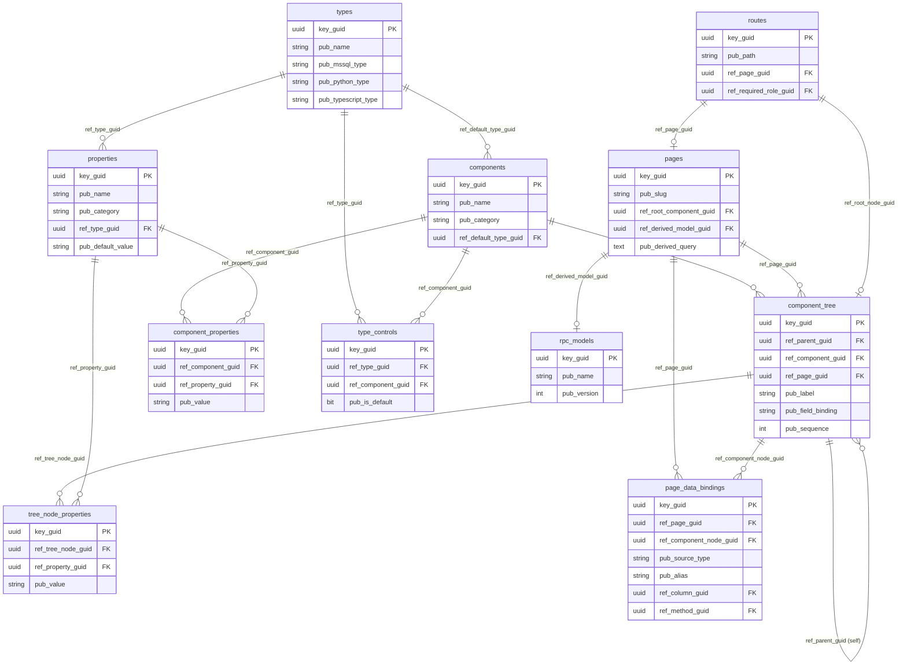
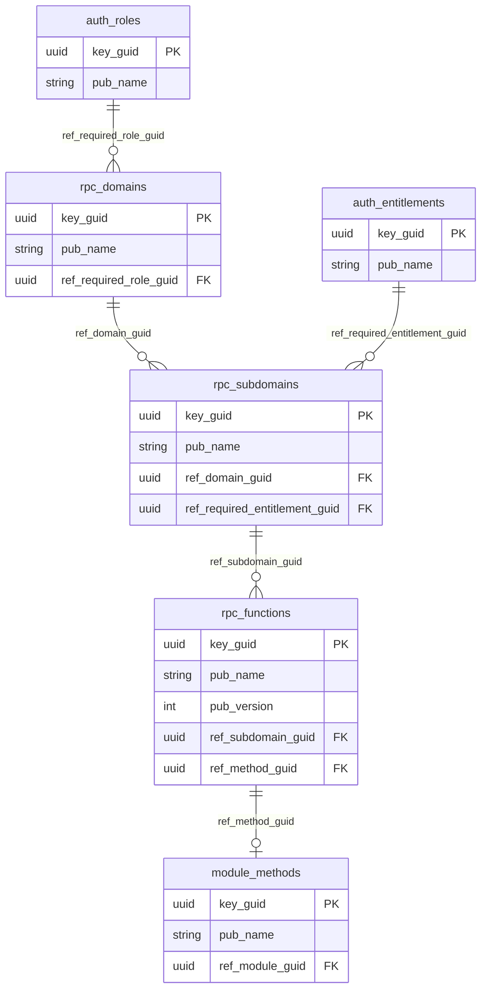
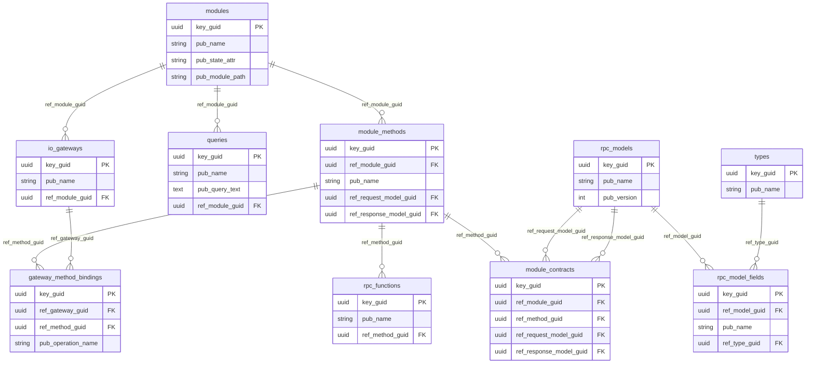
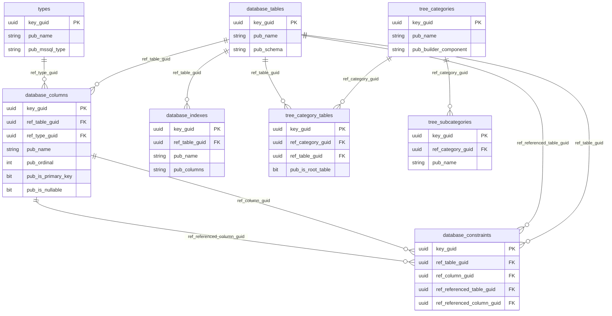
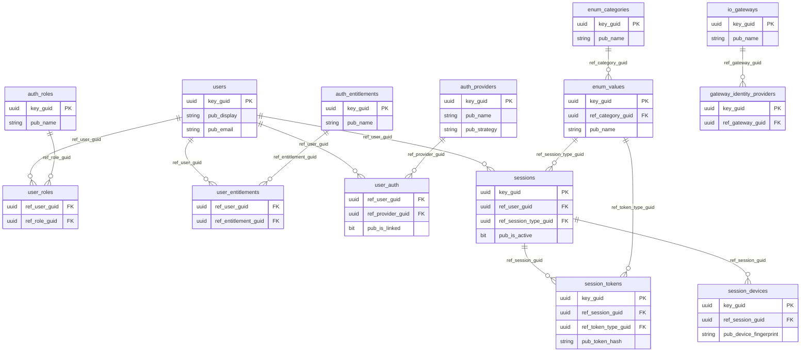

# TheOracleRPC — Data Model ERD

## CMS Rendering Engine

Components, composition trees, properties (3-layer resolution), pages, data bindings, and routes.

---

## RPC Dispatch Surface

Domains, subdomains, functions, and their method bindings. The data-driven dispatch graph.

---

## Module System

Modules, methods, contracts, queries, and gateway bindings. The server-side execution graph.

---

## Database Reflection

Tables, columns, types, constraints, indexes. The self-describing schema.

---

## Identity and Access

Users, roles, entitlements, sessions, tokens, OAuth providers, gateways.

